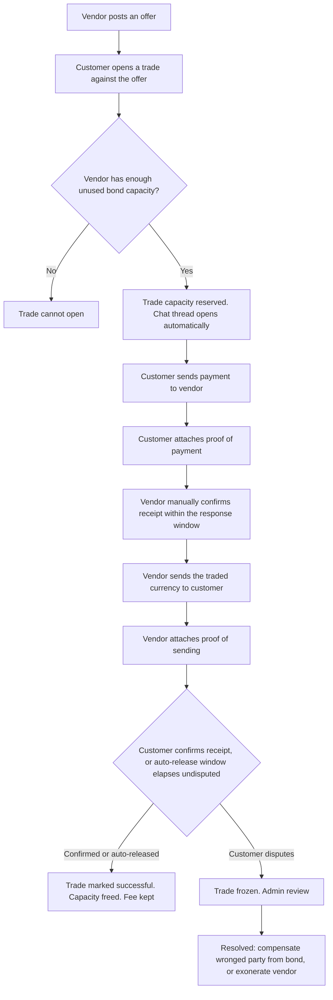
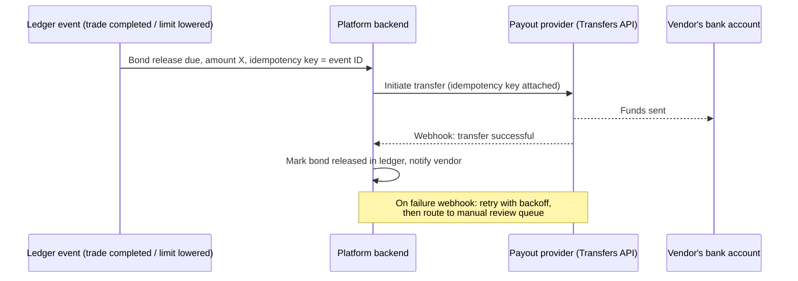

# Product Requirements Document (PRD) — P2P Exchange Platform

**Product:** Trex — a supervised peer-to-peer marketplace where vendors exchange foreign currency for Nigerian naira directly with customers, with the platform enforcing fairness through a vendor bond, escrow-style confirmations, and dispute resolution
**Version:** 1.3 (new product direction — supersedes the wallet-based Exchange App PRD v0.4)
**Date:** 19 September 2026
**Platforms:** iOS and Android app (mobile-first), plus an internal admin web dashboard
**Status:** Draft for founder review

> **What changed (v1.3):** the platform no longer holds customer deposits, runs a currency float, or moves converted funds itself. Depositing, converting and withdrawing wallet balances (PRD v0.4) are cancelled for now. The platform is now a **trusted intermediary for peer-to-peer trades**, modeled on Bybit P2P. Its only direct custody of money is the **vendor bond**. All trade currency moves directly between vendor and customer. Vendors now choose between two bond models (section 6.1) and can switch between them. The Verified Vendor / linked-account tier has been removed: all vendors use the same manual, proof-backed confirmation flow. Section 6.6 now specifies exactly how bond funding and release are automated through a payment aggregator's API.

---

## 1. Summary

Nigerians who earn in US dollars, British pounds or euros need to convert that money into naira, and separately, some Nigerians want to buy foreign currency with naira. Today this happens through informal, risky peer-to-peer arrangements with no protection if the other side doesn't pay up.

Trex makes this safe without becoming a bank. Vendors (currency sellers) prove they have something real to lose by posting a **bond**, then post offers. Customers trade directly against those offers. The platform never touches the trade currency itself, it enforces the rules: a vendor without a sufficient bond cannot open a trade, a trade only completes when both sides confirm, and a dispute pauses everything until a person reviews the evidence, most of which is captured automatically through in-app chat and proof-of-payment uploads.

## 2. Goals, non-goals and success metrics

### Goals
1. Let vendors and customers trade foreign currency for naira **safely, without either side risking their money on trust alone**.
2. Establish vendor trust **without requiring identity documents**, using financial commitment (the bond) and an earned track record.
3. **Automate the entire trade lifecycle** for the vast majority of trades — bond checks, chat, confirmations, bond release — so the platform intervenes only when a dispute is raised.
4. Keep the platform's own custody of money to the **minimum necessary** (the bond only), avoiding the licensing and treasury burden of holding customer funds.
5. Make disputes **rare, and resolvable**, by requiring proof at each step rather than relying on anyone's word.

### Non-goals for v1
- The platform holding, converting or moving customer trade currency itself (this is the cancelled wallet model, not this product)
- Identity-document-based KYC for vendors or customers
- Multi-country launch (Nigeria first; vendors trade USD, GBP and EUR against NGN)
- A platform-run vendor acting as backstop liquidity (open decision, section 15)

### Success metrics (initial targets)

| Metric | Target |
|---|---|
| Trades completed without a dispute | ≥ 97% |
| Median time from customer payment to trade completion | ≤ 45 minutes |
| Disputes resolved within | 24 hours |
| Vendor bond forfeiture rate (vendor at fault) | < 0.5% of trades |
| False "non-payment" claims by customers (vendor exonerated) | Tracked from day one; no target until baseline exists |
| Verified-vendor share of total trade volume | ≥ 60% by month 3 |
| Repeat customer rate (month 2) | ≥ 40% |

## 3. The three roles

| Role | Who | What they do |
|---|---|---|
| **Customer** | Anyone converting foreign currency to naira, or naira to foreign currency | Browses vendor offers, opens a trade, sends their side of the money, confirms receipt |
| **Vendor** | A currency trader who has posted a bond | Lists offers (rate, currency, limits, accepted payment methods), receives customer payment, sends the traded currency, confirms and releases |
| **Admin (you)** | Platform operator | Sets platform-wide rules and fees, resolves disputes, manages vendor standing, monitors system health. **Not involved in a normal trade** |

## 4. How trust is established, without ID documents

This is the core design problem the product solves. Three mechanisms combine to answer "why should a customer trust this vendor?":

### 4.1 The vendor bond (financial skin in the game)
Covered fully in section 6. In short: a vendor cannot open trades beyond what their bond can back. Fraud has a guaranteed, automatic financial consequence.

### 4.2 Earned track record
Every vendor accumulates a public, visible history: completion rate, number of trades, average confirmation time, dispute rate, customer ratings. New vendors start in a **probation tier** with small trade limits; limits rise automatically as the record grows, exactly like Bybit's merchant levels.

### 4.3 Mandatory proof at every step
No confirmation is ever taken on word alone. All vendors, regardless of trade history, confirm manually and back it with evidence:
- Customers must attach proof of payment (a bank/PayPal receipt screenshot) before a vendor is asked to confirm.
- Vendors must attach proof of sending the traded currency before the customer is asked to confirm.
- All of this lives permanently in the trade's chat thread, which becomes the evidence file if a dispute is opened.

## 5. The trade lifecycle

### Trade states

| State | Meaning |
|---|---|
| Offer posted | Vendor's listing is live |
| Trade opened | Customer has committed; vendor's bond capacity is reserved for this trade's value |
| Awaiting customer payment | Customer has not yet marked payment sent |
| Payment sent, awaiting confirmation | Customer has sent and attached proof; waiting on vendor confirmation within the response window |
| Payment confirmed, awaiting delivery | Vendor now sends the traded currency |
| Delivery sent, awaiting customer confirmation | Vendor has attached proof of sending |
| Completed | Both confirmations received (or auto-release elapsed). Capacity freed |
| Cancelled (pre-payment) | Either side backs out before customer pays. No penalty |
| Disputed | Either side raised a disagreement. Frozen for admin review |
| Resolved — vendor at fault | Bond forfeited to compensate customer |
| Resolved — vendor exonerated | Bond and fee fully protected; customer sanctioned per policy |

## 6. The vendor bond, in full

### 6.1 Structure: per-trade bond only (founder directive, decision 17)

> Every order locks **50% of that order's value** as bond for that trade
> alone — released on delivery, forfeited to the customer on vendor fault.
> The standing-bond model and model-switching (former §6.1.3) are removed.

Vendors pick whichever bond model fits how they trade, and can switch later (section 6.1.3).

**Per-trade bond (50%).** A fresh bond, sized at 50% of that specific trade's value, is posted when the trade opens and released back to the vendor the instant that trade completes. Nothing is locked between trades. Best for vendors who trade occasionally and don't want capital sitting idle.

**Standing bond (25%), tied to a trading limit.** The vendor sets a **trading limit** (the total value of trades they may have open at once) and posts a bond equal to **25% of that limit**, once. This single bond is not moved per trade; the platform only tracks how much of the vendor's limit is currently in use by open trades, and refuses new trades that would exceed it. Freed capacity from a completed trade is immediately available for the next one.

- **Raising the limit:** vendor tops up the bond to the new required amount.
- **Lowering the limit or leaving:** the freed portion of the bond, or the full bond, is returned automatically, once no trades are open against it.

The standing bond's lower percentage reflects that it's committed continuously rather than per transaction; the trade-off for a vendor is capital left locked during quiet periods, not per-trade cost.

### 6.1.3 Switching between models

A vendor may switch models whenever they choose, subject to:

1. **No open trades under the current model.** Existing trades finish under the terms they opened with; switching only affects trades opened afterward.
2. **Sequenced release and re-post.** Switching standing → per-trade releases the full standing bond immediately, since nothing is in use once no trades are open. Switching per-trade → standing requires posting the new 25% bond before standing capacity becomes active.
3. **A cooldown between switches** (default: 72 hours), to prevent a vendor from flipping models right before a specific trade purely to reduce that trade's required collateral.
4. **Trust score, tier and trade history carry over unchanged.** Switching bond models is a financial choice, not a reset of standing.

### 6.2 The fee
Charged **alongside** the bond as a separate, clearly labeled amount, not blended into it. The vendor's dashboard always shows two distinct figures: **Bond balance (refundable)** and **Fees paid (non-refundable)**, so there is never ambiguity about what belongs to whom.

### 6.3 Outcomes, by fault (not just "successful or not")

| Outcome | Bond | Fee | Why |
|---|---|---|---|
| **Trade completed successfully** | Fully released back to available capacity | Kept by platform | Normal revenue event |
| **Cancelled before customer pays** | Fully released, no penalty | Fully refunded | Nobody has lost anything yet |
| **Vendor at fault** (received payment, failed to deliver, or delivered less than agreed) | Forfeited, used to compensate the customer | Forfeited | This is precisely what the bond exists for |
| **Customer falsely claims non-payment** (vendor has valid proof showing no payment was received) | Fully protected and released | Fully protected, kept as normal | The vendor did nothing wrong |
| **Genuine dispute, evidence unclear** | Held frozen until admin review | Held frozen until admin review | Requires a human decision |

### 6.4 Automatic bond release mechanism
Because the bond already sits in the platform's custody (unlike the trade currency, which never does), automatic release is a straightforward rule, not a payment negotiation: **the instant a trade is marked Completed, a background process checks the vendor's bond ledger, confirms the trade's reserved capacity, and frees it — no person involved.** The same logic applies to forfeiture: the instant a trade is Resolved — vendor at fault, the compensation payment to the customer and the ledger adjustment fire automatically from the same event.

### 6.5 Protecting vendors from bad-faith customers
A vendor who has delivered and provided proof should never be held hostage by a customer who simply refuses to tap "confirm." An **auto-release grace period** (a set number of hours after delivery proof is attached) completes the trade automatically in the vendor's favor unless the customer has actively opened a dispute in that window.

### 6.6 Bond funding and automated payout — implementation plan

This section specifies exactly how bond money moves in and out of platform custody, for both bond models, so it can be built directly from this document.

#### 6.6.1 Provider choice

**Use a licensed Nigerian payment aggregator's API, not a single bank's proprietary API.** Direct bank APIs are generally reserved for large corporate clients with dedicated integration teams; an aggregator gives the same capability (programmatic transfers to any Nigerian bank account, plus dedicated account numbers for receiving money) without that barrier. This is the same category of provider already anticipated for NGN payouts elsewhere in the product.

- **Primary candidates:** Paystack, Flutterwave, Monnify (or an equivalent licensed aggregator). Final selection is an open decision (section 13) — evaluate on transfer fees, dedicated virtual account support, payout API reliability/SLA, and settlement speed.
- **Use one provider for both bond funding and bond release**, so funding and release are reconciled against a single system rather than two.
- **A secondary/backup provider** should be evaluated for redundancy once volume justifies it (Phase 2), so payouts don't stall if the primary provider has an outage.

#### 6.6.2 Bond funding (inflow) — how a vendor's bond reaches the platform

1. When a vendor sets up or increases a bond (per-trade first-time setup, or a standing-bond vendor choosing/raising their trading limit), the platform requests a **Dedicated Virtual Account (DVA)** for that vendor from the payout provider, if one doesn't already exist.
2. The vendor is shown that account's details and transfers the required bond amount to it from their own bank.
3. **Detection is dual, exactly as designed for the earlier deposit-detection work:**
   - The provider's **webhook** (e.g. a successful-charge event) notifies the platform the moment the transfer lands — the fast path.
   - A **scheduled reconciliation poll** against the provider's transaction/balance API acts as the backstop, catching anything a missed webhook would otherwise leave undetected.
4. On confirmed receipt, the ledger credits the vendor's **bond balance** (not the fee balance — see section 6.2) and, for a standing-bond vendor, activates or raises their trading limit.
5. An amount that doesn't match what was expected (wrong amount, unrecognized sender) goes to a review queue rather than being auto-applied — the same principle used throughout this product for anything ambiguous.

#### 6.6.3 Bond release (outflow) — how a vendor gets their bond back

The trigger differs by model, but the release mechanism is identical once triggered:

| Model | What triggers a release |
|---|---|
| **Per-trade** | The specific trade is marked **Completed** (or resolved in the vendor's favor) — that trade's bond releases individually |
| **Standing** | The vendor **lowers their trading limit** or **exits**, and has **no open trades** at that moment — the freed portion (or full bond) releases |

**Release sequence, for both models:**

1. The triggering ledger event fires (trade completion, or limit reduction/exit with zero open trades).
2. The platform calls the provider's **Transfers API**, sending the released amount to the vendor's **saved, verified bank account** (captured at vendor onboarding).
3. Every transfer call carries an **idempotency key derived from the ledger event ID**, so a retried request, a network timeout, or a duplicate trigger can never cause the same bond to be paid out twice.
4. The provider sends a **webhook confirming success or failure**. The ledger only marks the bond as released once that confirmation is received — not optimistically at the moment the API call is made.
5. **On failure** (e.g. account issue, provider error): automatic retry with backoff; after retries are exhausted, the payout moves to a **manual review queue** rather than silently failing or being left in limbo. The bond stays marked as owed-but-unreleased until resolved.
6. **On success:** the vendor is notified, and (for standing bonds) their available trading capacity is updated if applicable.

#### 6.6.4 Controls

- **Two-person approval above a threshold** (BND-17): any single release above a configurable amount requires a second admin's sign-off before the Transfers API call fires, mirroring the four-eyes rule already used elsewhere in this PRD for large financial actions.
- **Webhook signature verification** on every inbound webhook from the provider, so a forged "transfer successful" or "payment received" event can't be used to manipulate the ledger.
- **Daily reconciliation** (BND-18): the platform's ledger balance for bonds is compared against the payout provider's reported balance and the platform's linked bank account, with any mismatch alerted immediately rather than discovered later.
- **API credentials** stored in a secrets vault, never in application code, with separate keys for sandbox and live environments.

#### 6.6.5 Why this suits both bond models

The standing model releases **rarely** — only on a limit decrease or vendor exit — compared with the per-trade model, which releases **after every single completed trade**. This means:
- Fewer Transfers API calls overall for standing-bond vendors, which translates directly into lower transfer fees for the platform.
- It's a genuine, additional reason (beyond the lower 25% bond rate) to explain to frequent vendors why the standing model may suit them better — worth including in the in-app comparison copy for vendors choosing a model.

## 7. In-trade chat

- Opens **automatically** the moment a customer opens a trade, scoped to that trade only.
- Available to vendor and customer only; **not visible to admin** unless a dispute is opened, at which point it becomes the primary evidence.
- **Quick-action buttons** ("I've sent payment," "Please confirm receipt," "I've sent the currency") to speed up common exchanges.
- **Photo/file attachments** for payment proof and delivery proof, stored against the trade record.
- **Soft prevention of sharing outside contact details** (phone numbers, other messaging apps, social handles), since a trade taken off-platform loses all bond protection. Detected phrases are flagged and the message is held for review rather than delivered outright, with both parties told why.
- Retained for a defined period after trade completion (open decision, section 15) in case a delayed dispute is raised.

## 8. Functional requirements

Priority key: **P0** = MVP, **P1** = Phase 2, **P2** = later.

### FR-1 Onboarding (customers and vendors)

| ID | Requirement | Pri |
|---|---|---|
| ON-01 | Sign up with phone and email, verified by OTP | P0 |
| ON-02 | No government ID required for either role | P0 |
| ON-03 | In-house liveness check (carried over from the earlier design) to confirm a real person is present and to deter duplicate accounts | P0 |
| ON-04 | Vendor application flow: choose a trading limit, pay the corresponding bond, optionally link a PayPal or bank account | P0 |
| ON-05 | Vendor probation tier applied automatically to all new vendors regardless of bond size | P0 |

### FR-2 Vendor bond and ledger

| ID | Requirement | Pri |
|---|---|---|
| BND-01 | Vendor chooses per-trade bond (50% of each trade) or standing bond (25% of a chosen trading limit) at onboarding | P0 |
| BND-01a | Vendor may switch models later, subject to the rules in section 6.1.3 | P0 |
| BND-02 | Real-time tracking of a vendor's used vs. available trading capacity | P0 |
| BND-03 | Block new trades that would exceed a vendor's available capacity | P0 |
| BND-04 | Separate, clearly labeled ledger entries for bond (refundable) and fees (non-refundable) | P0 |
| BND-05 | Automatic bond capacity release the instant a trade is marked Completed | P0 |
| BND-06 | Automatic full refund of bond and fee for trades cancelled before customer payment | P0 |
| BND-07 | Automatic forfeiture and customer compensation workflow when a trade is Resolved — vendor at fault | P0 |
| BND-08 | Vendor-initiated limit increase (top-up) and limit decrease (partial refund once capacity is unused), for standing-bond vendors | P1 |
| BND-09 | Full bond withdrawal when a vendor exits, once no trades are open | P0 |
| BND-10 | Immutable ledger, append-only, reconciled daily | P0 |
| BND-11 | Model-switch workflow: block switching while trades are open, enforce the switch cooldown, and re-run onboarding bond checks for the new model | P0 |
| BND-12 | Payout provider integration for automated bond funding and release (see section 6.6) | P0 |
| BND-13 | Dedicated virtual account (DVA) per vendor for bond funding | P0 |
| BND-14 | Transfers API integration for bond release, with idempotency keys per ledger event | P0 |
| BND-15 | Dual detection for bond funding: provider webhook plus scheduled reconciliation polling | P0 |
| BND-16 | Automatic retry on payout failure, escalating to a manual review queue after exhausted retries | P0 |
| BND-17 | Two-person approval for any single bond release above a configurable threshold | P0 |
| BND-18 | Daily reconciliation: platform ledger vs. payout provider balance vs. linked bank account | P0 |

### FR-3 Vendor trust and verification

| ID | Requirement | Pri |
|---|---|---|
| TRU-01 | Manual confirmation flow with a bounded response window for all vendors | P0 |
| TRU-02 | Public vendor profile: completion rate, trade count, average response time, dispute rate, rating | P0 |
| TRU-03 | Tiered trading limits that rise automatically with a clean track record, and fall or freeze after disputes | P0 |
| TRU-04 | Probation tier limits and monitoring for new vendors | P0 |

### FR-4 Offers and matching

| ID | Requirement | Pri |
|---|---|---|
| OFR-01 | Vendors create offers: currency pair, rate, min/max trade size, accepted payment methods | P0 |
| OFR-02 | Customers browse and filter offers by currency, rate, vendor tier and rating | P0 |
| OFR-03 | Customers open a trade directly against a chosen offer | P0 |
| OFR-04 | Offer visibility and ranking favor higher-tier, better-rated vendors | P1 |
| OFR-05 | Rate guardrails: flag or restrict offers priced abnormally far from the market rate | P1 |

### FR-5 Trade engine

| ID | Requirement | Pri |
|---|---|---|
| TRD-01 | Full trade state machine as in section 5, enforced server-side | P0 |
| TRD-02 | Mandatory proof-of-payment upload before a vendor can be asked to confirm | P0 |
| TRD-03 | Mandatory proof-of-delivery upload before a customer can be asked to confirm | P0 |
| TRD-04 | Configurable time windows: vendor confirmation window, auto-release grace period | P0 |
| TRD-05 | Cancellation flow, allowed only before customer payment is marked sent | P0 |
| TRD-06 | Dispute button available to either party once payment has been marked sent | P0 |
| TRD-07 | Automatic capacity reservation and release tied to bond ledger events (see FR-2) | P0 |
| TRD-08 | Full audit trail per trade: every state change, timestamp and actor | P0 |

### FR-6 In-trade chat

| ID | Requirement | Pri |
|---|---|---|
| CHT-01 | Auto-opened chat scoped to each trade | P0 |
| CHT-02 | Quick-action message buttons | P0 |
| CHT-03 | Photo and file attachments | P0 |
| CHT-04 | Detection and soft-blocking of shared external contact details, with both parties notified | P1 |
| CHT-05 | Chat hidden from admin unless a dispute is opened on that trade | P0 |
| CHT-06 | Configurable retention period after trade completion | P1 |

### FR-7 Disputes

| ID | Requirement | Pri |
|---|---|---|
| DIS-01 | Either party can open a dispute once payment is marked sent | P0 |
| DIS-02 | Opening a dispute freezes the trade and the vendor's reserved capacity for it | P0 |
| DIS-03 | Dispute view for admins: full chat history, all uploaded proof, trade timeline | P0 |
| DIS-04 | Resolution actions: compensate customer from bond, exonerate vendor, partial resolution | P0 |
| DIS-05 | Two-person approval for any resolution that forfeits a vendor's bond above a set amount | P0 |
| DIS-06 | Customer sanctions for confirmed false claims (warnings, then suspension) | P1 |
| DIS-07 | Vendor sanctions for confirmed fault (rating impact, tier demotion, suspension for repeat cases) | P0 |
| DIS-08 | Dispute outcome history feeds both parties' trust records | P0 |

### FR-8 Notifications

| ID | Requirement | Pri |
|---|---|---|
| NOT-01 | Push/SMS/email for: trade opened, payment marked sent, confirmation needed, confirmation window closing, delivery sent, trade completed, dispute opened, dispute resolved | P0 |
| NOT-02 | Escalating reminders as a confirmation window nears expiry | P0 |

### FR-9 Ratings and trust

| ID | Requirement | Pri |
|---|---|---|
| RAT-01 | Both parties rate each other after a completed trade | P0 |
| RAT-02 | Ratings and dispute history are public on vendor profiles | P0 |
| RAT-03 | Repeated poor ratings trigger automatic review, independent of any dispute | P1 |

### FR-10 Admin dashboard

| ID | Requirement | Pri |
|---|---|---|
| ADM-01 | Role-based access, two-person approval for bond forfeitures above a set threshold | P0 |
| ADM-02 | Dispute queue with full trade evidence | P0 |
| ADM-03 | Vendor management: view bond, capacity, tier, history; suspend or demote | P0 |
| ADM-04 | Platform configuration: fee rates, confirmation windows, grace periods, tier thresholds | P0 |
| ADM-05 | Immutable audit log of every admin action | P0 |
| ADM-06 | Bond reserve monitoring (total bonds held vs. total exposure) | P0 |
| ADM-07 | Fraud pattern detection: repeated disputes involving the same vendor or customer, unusual offer pricing, rapid account creation | P1 |
| ADM-08 | Network-level lockdown for the admin dashboard (as previously specified) | P0 |

### FR-11 Support

| ID | Requirement | Pri |
|---|---|---|
| SUP-01 | In-app help center and ticketing, separate from trade chat | P0 |
| SUP-02 | Clear, published rules on outcomes and fault classification (section 6.3), shown at vendor and customer sign-up | P0 |

## 9. Non-functional requirements

| Area | Requirement |
|---|---|
| Performance | Trade actions (open, confirm, dispute) respond in under 1 second. Chat delivery near-instant |
| Availability | 99.9% for the trade engine and chat |
| Security | Encryption in transit and at rest, secrets vault, no vendor/customer identity data required or stored beyond what liveness and account-linking need |
| Data integrity | Bond ledger is append-only; every trade outcome traceable to the ledger events it triggered |
| Auditability | Every state change and admin action logged immutably |
| Privacy | Chat and proof files access-restricted; visible to admins only once a dispute is opened |
| Scalability | Trade engine and chat scale independently from the admin dashboard |
| Mobile | Works on low-end and higher-end Android devices and on slow networks (founder directive: full Android range, not low-end only) |
| Fraud monitoring | Automated flags for abnormal patterns (fast repeat disputes, offer prices far from market, new accounts trading at maximum limits immediately) |

## 10. Reference architecture (high level)

- **Mobile app:** Flutter or React Native
- **Backend:** modular services for onboarding/liveness, vendor and bond ledger, offers, trade engine, chat, disputes, notifications, admin
- **Data:** PostgreSQL for the ledger and trade records, Redis for chat presence and rate limiting, object storage for proof uploads and chat attachments
- **Integrations:** a licensed Nigerian payment aggregator (Paystack, Flutterwave, Monnify, or equivalent) for bond funding (dedicated virtual accounts) and bond release (Transfers API) — see section 6.6; the Nigerian instant-payment rail for real-time NGN payment visibility where applicable; push/SMS/email providers
- **Admin dashboard:** separate web app, network-restricted (FR ADM-08)

## 11. Roadmap (indicative)

| Phase | Scope |
|---|---|
| **0. Foundation** | Finalize open decisions (section 15), liveness R&D, bond ledger design, legal review of bond custody |
| **1. MVP** | Onboarding and liveness, vendor bond and standing-limit ledger, payout provider integration for bond funding and release (section 6.6), offers, trade engine (manual-confirmation path), in-trade chat, ratings, admin dispute dashboard. Closed beta with a small group of vetted vendors |
| **2. Automation** | Auto-release grace period, fraud pattern detection, tier auto-growth |
| **3. Expansion** | Additional currencies, business vendor accounts, possible platform-run backstop liquidity |

## 12. Risks and mitigations

| Risk | Mitigation |
|---|---|
| Vendor and customer collude to abuse the dispute process | Require proof at every step; track pattern-level fraud signals (ADM-07); human review with two-person approval on large forfeitures |
| Off-platform circumvention (parties move the deal to WhatsApp, losing bond protection) | Chat-level soft blocking (CHT-04); clear terms that off-platform deals carry no protection |
| Vendor liquidity is thin at launch | Consider a platform-run backstop vendor later (open decision); prioritize vendor onboarding and generous but bond-safe starting limits |
| Regulatory exposure from holding vendor bonds | Legal review during Phase 0; the platform's custody is deliberately minimized to the bond alone |
| Customers falsely claiming non-payment to extort vendors | Fault-based outcome classification (section 6.3); auto-release grace period (section 6.5) |
| A single large dispute exceeds a vendor's bond | Trading limits are always sized so the bond covers the vendor's maximum exposure; limits cannot be set above what the posted bond supports |

## 13. Open decisions

1. Fault classification: does the section 6.3 breakdown match your intent, or should any incomplete trade cost the vendor regardless of fault?
2. Grace period length for auto-release protecting vendors from unresponsive customers
2a. Confirm the 72-hour cooldown for switching between bond models, or set a different length
3. Chat retention period after trade completion
4. Strictness of the anti-off-platform-contact rule in chat (warn vs. block and flag)
5. Whether both directions launch together (customers selling FX for naira, and customers buying FX with naira) or one first
6. Whether a platform-run vendor ever backstops liquidity, or the market stays fully open
7. Whether businesses can become vendors at launch or only individuals
8. Whether the platform should cap or guide vendor rates, or leave pricing fully to competition
8a. Which payout provider to use for bond funding and release (Paystack, Flutterwave, Monnify, or another), and the two-person approval threshold for large bond releases (BND-17)
10. App name and brand — decided by founder: name is Trex; palette is black, blue, brown and red for safety and assurance (decision 12-13)
11. Legal review outcome on bond custody in Nigeria

## 14. Decision log

| # | Date | Decision |
|---|---|---|
| 1 | 19 Sep 2026 | Pivot from a wallet/float model to a supervised P2P marketplace, modeled on Bybit P2P. Deposit, convert and withdraw wallet features are cancelled for now |
| 2 | 19 Sep 2026 | The platform holds only the vendor bond. Trade currency moves directly between vendor and customer |
| 3 | 19 Sep 2026 | Vendor trust is established through a financial bond and earned track record — never through ID documents or account linking |
| 4 | 19 Sep 2026 | Vendors choose between two bond models: per-trade (50% of each trade) or standing (25% of a chosen trading limit), and may switch between them under the rules in section 6.1.3 |
| 5 | 19 Sep 2026 | Standing bond model uses a single bond tied to a trading limit, not a fresh bond per trade |
| 6 | 19 Sep 2026 | Fee is charged separately from the bond and always disclosed as a distinct, non-refundable line item; the bond itself is always fully refundable when the vendor is not at fault |
| 7 | 19 Sep 2026 | Trade outcomes are classified by fault (success, pre-payment cancellation, vendor fault, false customer claim, genuine dispute), not treated as one "unsuccessful" bucket |
| 8 | 19 Sep 2026 | In-trade chat opens automatically per trade, stays private unless a dispute is opened, and discourages moving contact off-platform |
| 9 | 19 Sep 2026 | The Verified Vendor / linked-account tier is removed. All vendors use the same manual, proof-backed confirmation flow |
| 10 | 19 Sep 2026 | Bond funding and release are automated through a licensed Nigerian payment aggregator: dedicated virtual accounts for funding, the Transfers API for release, both models triggering the same idempotent, webhook-confirmed release mechanism (section 6.6) |
| 11 | 27 Sep 2026 | Founder directive: mobile support covers the full Android range (low-end and higher-end devices), not low-end only |
| 12 | 27 Sep 2026 | Founder note: I chose black, blue, brown and red as the brand palette to give a feeling of safety and assurance (black = authority, blue = trust, brown = stability, red = danger only) |
| 13 | 27 Sep 2026 | Founder decision: product name is Trex |
| 14 | 28 Sep 2026 | Founder stack: Next.js app, NestJS API, PostgreSQL, Better Auth only + Resend for email, Cloudflare R2, Paystack |
| 15 | 29 Sep 2026 | Founder update: Termii removed; auth is Better Auth only, email via Resend |
| 16 | 1 Oct 2026 | Founder directive: Trex is global, not Nigeria-only — central currency/country registries, auto country + local-currency detection, USD/GBP/EUR defaults, full multi-currency marketplace, bond, trade, admin and launch architecture (NGN is one supported currency) |
| 17 | 2 Oct 2026 | Founder directive: ONE bond model only — per-trade 50% of each order's value, locked per trade and released on delivery. Standing bond and model-switching are removed; vendor landing + 50% rule + do's and don'ts added |
| 18 | 2 Oct 2026 | Founder directive: vendors are customers first — no second signup; vendor CTA goes to offers; vendor profiles carry photo, bio, country, reply pledge, languages and verification badges so no vendor is anonymous |
| 19 | 2 Oct 2026 | Resend email delivery LIVE — real inbox code verified end to end via /api/verify; trade receipts and review notices deliver for real |
| 20 | 2 Oct 2026 | Global SMS via Better Auth phone OTP + Twilio sender (all dialling codes in signup); wired with honest preview fallback until Twilio keys land |
| 21 | 2 Oct 2026 | Phone verification CANCELLED — email-only verification; signup is now Country → Email → Security → Vendor; SMS/Twilio shelved |
| 22 | 4 Oct 2026 | Auto country detection REMOVED — users select their own country at signup and in Settings |

## 15. Parking lot

- Screen-by-screen UX for the P2P flows (offer browsing, trade room, dispute filing) — brand palette per founder note: black, blue, brown and red (see decision 12), preview in `design.html`
- Admin dashboard detail (already partly specified: dispute queue, vendor management)
- Detailed fee percentage and bond percentage tuning after beta data
- Referral or vendor incentive programs
- Business/team vendor accounts
- Additional currencies beyond USD, GBP, EUR

## 16. Glossary

- **Bond:** a refundable deposit a vendor posts to prove financial commitment and to compensate a wronged customer if the vendor is at fault
- **Standing bond:** a single bond tied to a trading limit, rather than a fresh bond per trade
- **Trading limit / capacity:** the total value of trades a vendor may have open at once, backed by their bond
- **Auto-release grace period:** the window after which a trade completes automatically in the vendor's favor if the customer does not respond or dispute
- **Fault classification:** the rule set determining who bears the cost of an incomplete trade
